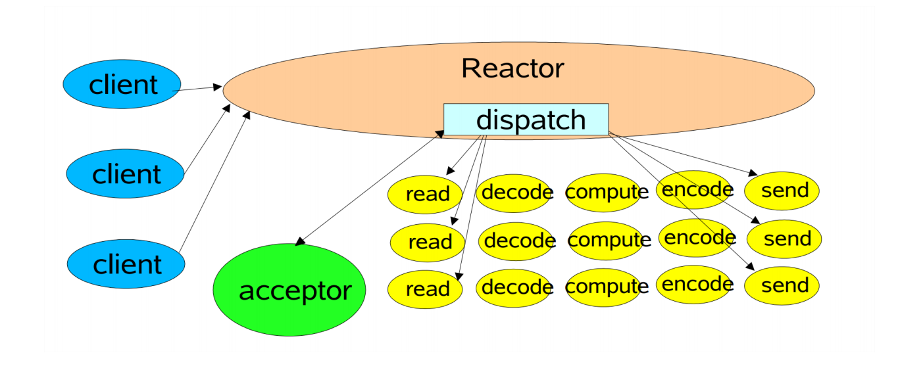
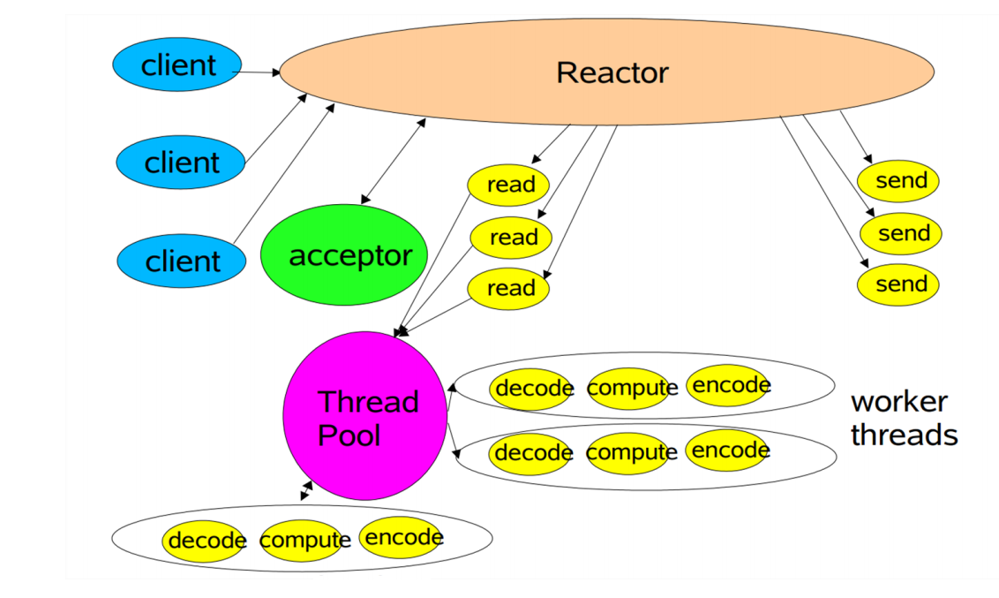
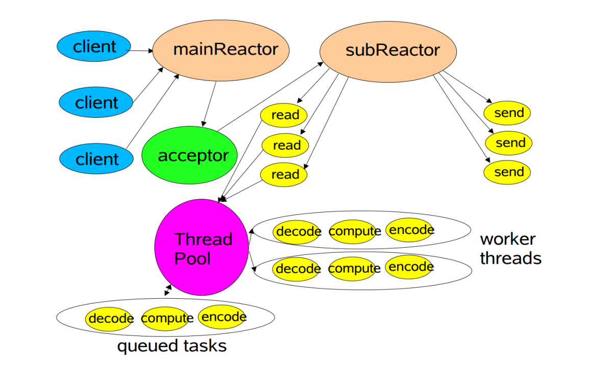

# 回顾一下IO四个属性

阻塞：线程等待事件就绪，即使某个IO缓冲区没有数据，或者数据已满。**让线程等，线程就会死等下去，直到事件就绪**。

非阻塞：线程不会等待事件就绪，当发现事件不可用时，会直接返回。

同步：数据就绪后，需要线程主动去读取。

异步：数据就绪后，数据会被**某个组件（这里依赖操作系统的实现）**加载好，回调给线程进行处理。

# 回顾一下Java的BIO与NIO的区别

以下是BIO代码节选（伪代码）：

```java
        ServerSocket serverSocket = new ServerSocket(9000);
        while (true) {
            System.out.println("Wait for connection ...");
            Socket clientSocket = serverSocket.accept();
            clientSocket.getChannel().read();
            clientSocket.getChannel().write();
        }
```

serverSocket.accept()等待连接到来，当连接到来后，可以通过channel.read()读取客户端传过来的数据，如果数据还未读就绪，channel.read()会一致阻塞。同理，通过channel.write()向客户端写数据。如果数据还为写就绪，channel.write()也会一致阻塞着。

在刚开始学Java的时候，看到这段代码，我第一反应是“多线程不就好了？”，首先accept阻塞对于main线程来说是必须的，毕竟要等待连接的到来，但是read()和write()阻塞会影响main线程accpet下一个请求。如果改成多线程，会是这样的（伪代码）：

```java
		ServerSocket serverSocket = new ServerSocket(9000);
        while (true) {
            System.out.println("Wait for connection ...");
            Socket clientSocket = serverSocket.accept();
            new Thread(()->{ // 当然，实际是线程池工作，这里偷懒
                clientSocket.getChannel().read();
                clientSocket.getChannel().write(); 
            });
        }
```

将main线程的read()阻塞和write()阻塞下沉到另一个线程，这样**只是把阻塞转移了，但阻塞的问题依旧存在**。举一个不太合理的例子：假设现在100个客户端发起连接，但是不发送任何数据，那么服务端就会有100个线程阻塞在read()阶段。哪怕是聪明一点用线程池来处理，也会引发线程池的降级逻辑，最终结果是一样的：服务不可用。

再看一下NIO的代码（伪代码）：

```java
ServerSocketChannel serverSocketChannel = ServerSocketChannel.open();  
serverSocketChannel.configureBlocking(false);  
ServerSocket serverSocket = serverSocketChannel.socket();  
serverSocket.bind(new InetSocketAddress(port));  
selector = Selector.open();  
serverSocketChannel.register(selector, SelectionKey.OP_ACCEPT);  // 注册accpet事件
         
while (true) { 
	selector.select(); // 阻塞  
    Set<SelectionKey> selectionKeys = selector.selectedKeys();  
    Iterator<SelectionKey> iterator = selectionKeys.iterator();  
    while (iterator.hasNext()) {          
    	SelectionKey selectionKey = iterator.next();  
        iterator.remove(); 
        if (selectionKey.isAcceptable()) {
             server = (ServerSocketChannel) selectionKey.channel(); 
             SocketChannel client = server.accept();
             client.configureBlocking(false);
             client.register(selector, SelectionKey.OP_READ); // 注册读就绪事件
        } else if (selectionKey.isReadable()) {  
             // 处理读就绪事件，可以采用多线程方式
        } else if (selectionKey.isWritable()) {  
             // 处理写就绪事件，可以采用多线程方式
        }
    }  
} 
```

可以看到，阻塞只发生在main线程的selector.select()阶段，当阻塞结束后，必定会有对应事件就绪的连接返回，如果是accpet事件，则将channel注册读就绪事件到selector。同理，如果是读就绪事件 或 写就绪事件，则交给对应的工作线程进行处理，**在此过程中没有BIO的read()阻塞和write()阻塞**

# Netty的3种IO模式支持

实际上，早期Netty支持BIO、NIO、AIO，但后期BIO被标记为Deprecated，而AIO直接被删除，主要有以下原因：

1. 结合上面的代码可以看到，BIO在连接数多、并发度高的场景下缺点很大，没有支持的必要。
2. AIO在Windows上实现比较成熟，但Windows Server的使用范围很少，所以Netty干脆不支持。
3. 虽然Linux是主流Server，但AIO的实现不够成熟，和NIO相比性能提升不明显。

结合以上3点，Netty干脆放弃维护AIO，并且标记BIO为过时。

# 回顾一下Channel与Event

在Java NIO的世界里，主要有2种Channel：ServerSocketChannel，SocketChannel，它们在客户端、服务端的领域里关心的事件也不一样：

|        |    ServerSocketChannel / SocketChannel    | Accpet | Connect | Read | Write |
| :----: | :---------------------------------------: | :----: | :-----: | :--: | :---: |
| Client |             只有SocketChannel             |        |    √    |  √   |   √   |
| Server |  ServerSocketChannel（Server眼里的门面）  |   √    |         |      |       |
| Server | SocketChannel（Server眼里的直接交互通道） |        |         |  √   |   √   |

不难理解，首先Client作为主动发起请求的一方，眼里只有一个 Channel 与 Server 通信。

其次，Server眼里有两个Channel与Client通信，分别是用于接收请求的ServerSocketChannel，和接收读写的SocketChannel。其实严格意义上Server和Client直接交互的只有SocketChannel，毕竟ServerSocketChannel只是等待Client发起三次握手连接，然后生成对应的SocketChannel而已，把ServerSocketChannel当成 门面 或者 Dispatcher 更加合适。

# 回顾一下Reactor模型

对于不同的网络模型，有不同的开发模式，比如：

|          BIO          |   NIO   |   AIO    |
| :-------------------: | :-----: | :------: |
| Thread Per Connection | Reactor | Proactor |

对于Reactor模型，简单来说只有3步：

1. 连接 注册 就绪事件。
2. 操作系统 等待 就绪事件。
3. 事件就绪，操作系统 通知 线程 获取事件。

Reactor是一种模型，具体的实现有select、poll、epoll，之前的[笔记](https://github.com/9029HIME/Netty_Study/blob/783c13a8ae334a375683fdcb03c57b68089cc88f/src/main/java/com/genn/02%20NIO%E4%B8%8E%E9%9B%B6%E6%8B%B7%E8%B4%9D/NIO%E5%BA%95%E5%B1%82%EF%BC%88select%E3%80%81epoll%EF%BC%89.md)已经整理过，不再赘述。

## Reactor V1



最原始也是最简单的模型，许多NIO的Demo都是基于这个模型开发，简单来说就是：**selector的线程 和 工作线程 是同一个线程**，如果工作线程阻塞，也会导致selector线程阻塞。

## Reactor V2



V1的优化版，这次将 selector线程 和 工作线程 分开，并且考虑到多客户端连接的情况，将 工作线程 替换为 工作线程池，通过线程池的异步处理能力增加服务器的吞吐量。

## Reactor V3



V2的优化版，既然工作线程可以交给线程池来做，那么selector线程是否也能池化管理呢？答案是可以的。客户端连接的时候，第一交互是selector线程池，selector线程池里的线程只干一件事：accpet请求，获取SocketChannel，注册事件。当就绪事件触发后，再交给工作线程池里的线程处理。这样，不仅提高了服务器处理请求的吞吐量，也**增加了接收请求的吞吐量**。

## Netty对于Reactor的支持

Netty对于线程池进行了封装，成品叫EventLoppGroup，对于Reactor模型的选型，具体区别在于ServerBootstrap的构造：

V1（线程数=1）：

```
EventLoopGroup workerGroup = new NioEventLoopGroup(1);
ServerBootstrap serverBootstrap = new ServerBootstrap();
serverBootstrap.group(workerGroup)
```

V2（默认情况下线程数=机器逻辑核数）：

```java
EventLoopGroup workerGroup = new NioEventLoopGroup();
ServerBootstrap serverBootstrap = new ServerBootstrap();
serverBootstrap.group(workerGroup)
```

V3（新建2个线程池，按照 selector线程池、工作线程池的顺序构造）：

```java
EventLoopGroup bossGroup = new NioEventLoopGroup();
EventLoopGroup workerGroup = new NioEventLoopGroup();
ServerBootstrap serverBootstrap = new ServerBootstrap();
serverBootstrap.group(bossGroup,workerGroup)
```

